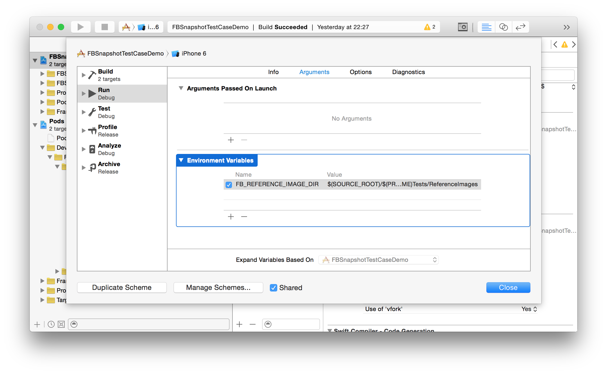

FBSnapshotTestCase
======================

[](https://travis-ci.org/facebook/ios-snapshot-test-case) [](http://cocoadocs.org/docsets/FBSnapshotTestCase/)

What it does
------------

A "snapshot test case" takes a configured `UIView` or `CALayer` and uses the
`renderInContext:` method to get an image snapshot of its contents. It
compares this snapshot to a "reference image" stored in your source code
repository and fails the test if the two images don't match.

Why?
----

At Facebook we write a lot of UI code. As you might imagine, each type of
feed story is rendered using a subclass of `UIView`. There are a lot of edge
cases that we want to handle correctly:

- What if there is more text than can fit in the space available?
- What if an image doesn't match the size of an image view?
- What should the highlighted state look like?

It's straightforward to test logic code, but less obvious how you should test
views. You can do a lot of rectangle asserts, but these are hard to understand
or visualize. Looking at an image diff shows you exactly what changed and how
it will look to users.

We developed `FBSnapshotTestCase` to make snapshot tests easy.

Installation with CocoaPods
---------------------------

1. Add the following lines to your Podfile:

     ```
     target "Tests" do
       pod 'FBSnapshotTestCase'
     end
     ```

   If you support iOS 7 use `FBSnapshotTestCase/Core` instead, which doesn't contain Swift support.

   Replace "Tests" with the name of your test project.

2. There are [three ways](https://github.com/facebook/ios-snapshot-test-case/blob/master/FBSnapshotTestCase/FBSnapshotTestCase.h#L19-L29) of setting reference image directories, the recommended one is to define `FB_REFERENCE_IMAGE_DIR` in your scheme. This should point to the directory where you want reference images to be stored. At Facebook, we normally use this:

|Name|Value|
|:---|:----|
|`FB_REFERENCE_IMAGE_DIR`|`$(SOURCE_ROOT)/$(PROJECT_NAME)Tests/ReferenceImages`|




Creating a snapshot test
------------------------

1. Subclass `FBSnapshotTestCase` instead of `XCTestCase`.
2. From within your test, use `FBSnapshotVerifyView`.
3. Run the test once with `self.recordMode = YES;` in the test's `-setUp`
   method. (This creates the reference images on disk.)
4. Remove the line enabling record mode and run the test.

Features
--------

- Automatically names reference images on disk according to test class and
  selector.
- Prints a descriptive error message to the console on failure. (Bonus:
  failure message includes a one-line command to see an image diff if
  you have [Kaleidoscope](http://www.kaleidoscopeapp.com) installed.)
- Supply an optional "identifier" if you want to perform multiple snapshots
  in a single test method.
- Support for `CALayer` via `FBSnapshotVerifyLayer`.
- `usesDrawViewHierarchyInRect` to handle cases like `UIVisualEffect`, `UIAppearance` and Size Classes.
- `isDeviceAgnostic` to allow appending the device model (`iPhone`, `iPad`, `iPod Touch`, etc), OS version and screen size to the images (allowing to have multiple tests for the same «snapshot» for different `OS`s and devices).

Notes
-----

Your unit test must be an "application test", not a "logic test." (That is, it
must be run within the Simulator so that it has access to UIKit.) In Xcode 5
and later new projects only offer application tests, but older projects will
have separate targets for the two types.

Authors
-------

`FBSnapshotTestCase` was written at Facebook by
[Jonathan Dann](https://facebook.com/j.p.dann) with significant contributions by
[Todd Krabach](https://facebook.com/toddkrabach).

License
-------

`FBSnapshotTestCase` is BSD-licensed. See `LICENSE`.
